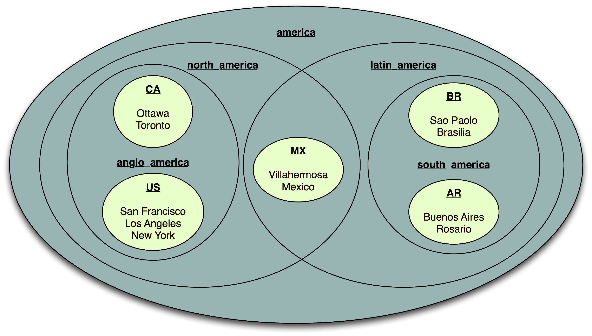

# Advanced Topics

## JavaBeans and the Benerator Context

You can instantiate JavaBeans by an intuitive syntax like this:

```xml
<bean id="helper" class="com.my.Helper">
    <property name="min" value="5"/>
    <property name="max" value="23"/>
</bean>
```

The _class_ attribute denotes which JavaBean class to instantiate (by the default constructor). The enclosed property tags cause the JavaBean's
properties and attributes to be set to appropriate values. Benerator converts common types automatically. If Benerator cannot perform conversion of a
custom type, you can define a custom ConverterManager setup (see rd-lib-common). Date and time formatting is supported according to ISO 8601 Conventions.

Objects are made available by exposing them in a context. The id attribute defines the name with which an object can be found, e.g. for a 'source'
or 'ref' attribute of another element's setup.

So the example above creates an instance of a DBSystem JavaBean class, setting its properties to values for connecting a database. The object is
retrievable by the context with the id 'db'.

!!! note

        The class DBSystem implements the interface 'System' which provides (among other features) meta information about the entities (tables)
        contained in the database.

You can create references to other objects declared before by a 'ref'-attribute in the bean declaration. The following example shows this for a task
setup, but this can be applied to beans and consumers as well.

!!! note

    You may implement the System interface for connecting to other system types like SAP or Siebel systems.

JavaBeans may refer each other (see `proxy.target`) and may have collection or attribute properties (see `log_csv.components`) as shown in the following
example:

```xml
<bean id="csv" class="CSVEntityExporter">
    <property name="uri" value="target/customers.csv"/>
    <property name="columns" value="salutation,first_name,last_name"/>
</bean>

<bean id="proxy" class="shop.MyProxy">
    <property name="target" ref="csv"/>
</bean>

<bean id="log_csv" class="ConsumerChain">
    <property name="components">
        <bean class="LoggingConsumer"/>
        <idref bean="proxy"/>
    </property>
</bean>
```

You can use all inline construction styles in a spec attribute, too. 

You can invoke methods on beans using rapiddwellerScript:

`<execute>myBean.init(47 + 11)</execute>`

## Importing Java classes

Benerator provides an import facility similar to the Java language. You can import classes, packages and domains.

So, instead of using the fully qualified name:

`<bean id="special" class="com.my.SpecialGenerator" />`

you can import the class and use the local name:

```xml
<import class="com.my.SpecialGenerator"/>

<bean id="special" class="com.my.SpecialGenerator"/>
```

The following alternative works as well and imports all classes of the com.my package:

```xml
<import class="com.my.*"/>

<bean id="special" class="com.my.SpecialGenerator"/>
```

### Step-by-step instruction: Importing Custom Java classes (JAR)

Precondition: Verified local benerator installation (cp. [Installation](installation.md)). 

In this example, two jars from maven central are used for demo purposes: 

1. Download following jars locally  
* [commons-lang3-3.9.jar](https://repo1.maven.org/maven2/org/apache/commons/commons-lang3/3.9/commons-lang3-3.9.jar)
* [commons-io-2.6.jar](https://repo1.maven.org/maven2/commons-io/commons-io/2.6/commons-io-2.6.jar)
2. Move the jars into the `lib\` folder of your benerator installation
   e.g. ( e.g. `C:\Program Files\Development\rapiddweller-benerator-ce\lib\`). Avoid creating 
   any subfolder(s) in the `lib\` directory and place the jar file(s) in the lib folders root level. 

3. Given the custom libraries are provided in your ben lib folder, or you added them to the classpath
    of your Java Virtual Machine (JVM), the following benerator script shows you the available 
    instantiation options:

```xml
<setup>

    <!-- Use direct reference (OPTION A) -->
    <generate type="optionA" consumer="ConsoleExporter" count="5">
        <attribute name="column" 
                   type="string" 
                   script="org.apache.commons.text.WordUtils.swapCase('A: benerator is a GREAT universal data tool')" />
    </generate>

    <!-- Import multiple classes from custom jar (OPTION B) -->
    <import class="org.apache.commons.text.WordUtils"/>
    
    <!-- Import multiple classes from custom jar with wildcard (OPTION C) -->
     <import class="org.apache.commons.text.*"/> 

    <!-- Use OPTION B/C in BENERATION -->
    <generate type="optionBC" consumer="ConsoleExporter" count="5">
        <attribute name="column" type="string" script="WordUtils.swapCase('B/C: benerator is a GREAT universal data tool')"/>
    </generate>

    <!-- Instantiate single class as bean (OPTION D) -->
    <bean id="customUtil" class="org.apache.commons.text.WordUtils">
        <!-- Allows to define properties for your constructor as below if required -->
        <!--  <property name="myProperty" value="12345"/> -->
    </bean>

    <!-- Use OPTION D in BENERATION -->
    <generate consumer="ConsoleExporter" count="5" type="optionB">
        <attribute name="column" type="string" script="customUtil.swapCase('D: benerator is a GREAT universal data tool')"/>
    </generate>

</setup>
```

### Domain imports

Domains can be imported as well. For the built-in Benerator domains, only the domain name is necessary, for custom domains, the fully qualified name
    of the domain's top-level package. For a built-in domain:

```xml
<import domains="person"/>

<bean id="personGen" class="PersonGenerator"/>
```

For a custom domain:

```xml
<import domain="com.my"/>

<bean id="myGen" class="MyGenerator"/>
```

## Looking up services/objects via JNDI

Benerator provides an `InitialContext` class in the JNDI platform package. It can be used to locate objects and make them available in Benerator:

```xml
<import platforms="jndi"/>

<bean id="ctx" class="InitialContext">
    <property name="factory" value="..."/>
    <property name="url" value="..."/>
    <property name="user" value="..."/>
    <property name="password" value="..."/>
</bean>

<bean id="ejb" spec="ctx.lookup('cons')"/>
```

## Calculating global sums

Sometimes you need to calculate the total sum of one field over all generated instances, e.g. for calculating checksums. The AddingConsumer is there
to help you with this task. Instantiate it as `<bean>`, specifying the field name to add and the number type to use, then use it as consumer and
finally query its 'sum' property value with a script expression:

```xml

<bean id="adder" spec="new AddingConsumer('_txn_amount_', 'long')"/>

<generate type="deb_transactions" count="100" consumer="ConsoleExporter, adder">
    <attribute name="_txn_amount_" type="long" min="1" max="100" distribution="random"/>
</generate>

<generate type="trailer_record" count="1" consumer="ConsoleExporter">
    <attribute name="total" script="adder.sum"/>
</generate>
```

## Querying data from a system to variables

Querying is discussed in Data Generation Concepts.

Benerator supports to store multiple values in variables at runtime 
that can be accessed array-like to use the data for multiple attributes i.e. fulfill multi-field constraints. 

Given a variable named `productInfo` 
and a selector that queries 3 values (e.g. `select ean_code,product_name,product_no from ...` ) from a product database  
the values are accessed by `productInfo[0]`, `productInfo[1]`, `productInfo[2]` using the `script` element. 

```xml

<generate type="shop" count="10">
    <attribute name="country" values="DE,AT,CH"/>
    <generate type="product" count="100" consumer="db">

        <variable name="productInfo"
                  source="db"
                  selector="{ftl: select ean_code,product_name,product_no from db_product where country='${shop.country}'}}" 
                  cyclic="true"  
        />
                
        <attribute name="ean_code" 
                   script="productInfo[0]"/>                
        <attribute name="product_name" 
                   script="productInfo[1]"/>                
        <attribute name="product_no" 
                   script="productInfo[2]"/>
    </generate>
</generate>
```

!!! warning

    Set **cyclic="true"** if not enough products for the given country value are available in your dataset.

## The MemStore

The MemStore is a simple implementation of the StorageSystem interface which allows yo to store entity data in RAM and perform simple queries on them.
This is useful in cases where you need to generate data where there are internal dependencies but no database is involved, e.g. generating an XML file
with products and orders.

A MemStore is declared with a `<memstore>` element:

`<memstore id="store"/>`

You can use it as a consumer for storing data (in this case products):

```xml
<generate type="product" count="10" consumer="store,ConsoleExporter">
    <id name="id" type="int"/>
    <attribute name="name" pattern="[A-Z][a-z]{4,12}"/>
</generate>
```

Afterwards you can query the generated products for referencing them in generated orders:

```xml
<generate type="order" count="10" consumer="ConsoleExporter">
    <variable name="product" source="store" type="product"/>
    <id name="id" type="int"/>
    <attribute name="product_id" script="product.id"/>
</generate>
```

!!! warning

    Note that you can **only** query for entities – if you need a single attribute of an entity, 
    you must first use a variable to get the entity and afterwards retrieve the required attribute by script.

You can use a distribution:

`<variable name="product" source="store" type="product" distribution="random"/>`

A simple form of query is supported by a `selector` element. Its content must be a script expression that serves as a filter. The expression is
consecutively evaluated on each element (as candidate) and has to return `true` if the candidate is accepted, otherwise `false`. 

!!! danger

    **IMPORTANT**: The script can only access each candidate by using the keyword **_candidate**.

As an example, here is a query which only returns products whose name starts with '**A**':

```xml
<variable name="product" source="store" type="product" selector="_candidate.name.startsWith('A')"/>
```

## Datasets

You can define datasets and combine them with supersets. This mechanism lets you also define parallel and overlapping hierarchies of nested datasets.

Definition of hierarchies is separated from the definition of dataset values for a concrete topic. So you can define a dataset grouping for regions,
mapping continents, countries, states and departments and apply this grouping to define and combine sets of e.g. cities, person names or products.

We will apply the mechanism here for cities in geographical regions. You can find the example files in the distribution's directory demo/dataset/

A dataset is identified by a code. For a country, its ISO code is an appropriate choice, but you are free to define and choose what is useful for your
application.

Assume you wanted to process some American countries: US (USA), CA (Canada), MX (Mexico), BR (Brazil), AR (Argentina)

You could group them geographically (North America vs. South America) or by language (Latin America vs. Anglo America). You could do both in parallel
by defining area sets in a file area.set.properties :

```properties
latin_america=MX,BR,AR
anglo_america=US,CA
north_america=US,CA,MX
south_america=BR,AR
america=north_america,south_america
```



The simple datasets would be defined in CSV files:

`cities_US.csv`:

```
San Francisco

Los Angeles

New York
```

`cities_CA.csv`:

```
Ottawa

Toronto

cities_MX.csv

Mexico

Villahermosa

cities_BR.csv

Sao Pãolo

Brasilia

cities_AR.csv

Buenos Aires

Rosario
```

You can now use this setup to generate city names for any of the specified regions. For North American cities you could specify

```xml
<echo message="north american cities:"/>

<generate type="city" consumer="exporter" count="10">
    <attribute name="name" unique="true"
               source="city_{0}.csv" encoding="UTF-8"
               dataset="north_america" nesting="area"/>
</generate>
```

and generate the output:

north american cities:

```shell
city[name=Mexico]
city[name=Los Angeles]
city[name=San Francisco]
city[name=New York]
city[name=Villahermosa]
city[name=Ottawa]
city[name=Toronto]
```

### Region nesting

Benerator comes with a predefined nesting definition for geographical datasets, called 'region':

```properties
europe=western_europe,central_europe,southern_europe,eastern_europe,northern_europe
western_europe=PT,ES,AD,FR,MC
central_europe=BE,NL,LU,DE,CH,AT,LI
southern_europe=IT,SM,VA,GR,CY,TR
eastern_europe=AL,SI,CZ,HU,PL,RU,RO,BG,HR,BA,EE,LT,LV,SK,UA
northern_europe=GB,IE,DK,SE,NO,FI,IS
near_east=AF,IR,IL,JO,KZ,PK,QA,SA,AE
africa=EG,GH,KE,ZA
north_america=US,CA
central_america=MX,BS
america=north_america,central_america,south_america
south_america=BR,CL,AR,EC
asia=JP,IN,ID,KR,KP,MY,SG,TW,TH
oceania=AU,NZ
```

### Default Datasets:

The current available datasets include the following countries and nesting regions:

```properties
europe=western_europe,central_europe,southern_europe,eastern_europe,northern_europe
western_europe=french,iberia
french=FR,MC
iberia=spanish,PT
spanish=ES,AD
central_europe=benelux,dach,LI
benelux=NL,BE,LU
dach=DE,CH,AT
southern_europe=italian,greek,TR
italian=IT,SM,VA
greek=GR,CY
eastern_europe=baltics,yugo,PL,AL,CZ,HU,RU,RO,BG,SK,UA
baltics=EE,LT,LV
yugo=SI,HR,BA
northern_europe=british_isles,nordic_countries
british_isles=GB,IE
nordic_countries=scandinavia,FI,IS
scandinavia=SE,DK,NO
north_america=US,CA
oceania=AU,NZ
VE
VN
TH
BR
```

If you use the 'dataset' for any countries that are not included in the list above, you will receive an ERROR message, and the data will fall back to the US.

We will update more datasets in the future, and we will be very glad if everyone can contribute to the Benerator application by adding datasets for countries that are not currently included.

## Chaining generators

Generators can be chained, composed, or reused in different contexts. You can do so by instantiating a generator as JavaBean and referring it in
properties of other JavaBean-instantiated generators or specifying it as `source` attribute like an importer.

```xml
<!-- creates a text generator /-->
<bean id="textGen" class="RegexStringGenerator">
    <property name="pattern" value="([a-z]{3,8}[ ])*[a-z]{3,8}\."/>
</bean>

<!-- wraps the text generator and creates messages /-->
<generate type="message" count="10" consumer="LoggingConsumer">
    <attribute name="text" source="textGen" converter="MessageConverter" pattern="Message: ''{0}''"/>
</generate>
```

## Invoking Benerator programmatically

For integrating Benerator with other applications, you can invoke it programmatically in a Java application too.

### Invoking Benerator as a whole

For executing descriptor files do the following:

```java
// create an instance of the Descriptor runner specifying the descriptor file
DescriptorRunner runner = new DescriptorRunner("path/to/file/benerator.xml");
BeneratorContext context = runner.getContext();
// use the BeneratorContext to set locale, file encoding, ... as you need
context.setValidate(false);
runner.run();
```

### Making Benerator generate data and invoke a custom class with it

If you want to use Benerator for feeding a custom class with generated data, implement the Consumer interface in a way that connects to your program,
instantiate it and register it with the BeneratorContext:

```java
DescriptorRunner runner = new DescriptorRunner("path/to/file/benerator.xml");
BeneratorContext context = runner.getContext();
context.setValidate(false);
MyConsumer myConsumer = new MyConsumer();
context.set("myConsumer", myConsumer); // add a custom Consumer
runner.run();
```

A simplistic implementation could simply write entities to the console, e.g.

```java
class MyConsumer extends AbstractConsumer`<Entity>` {
    List`<Entity>` products = new ArrayList`<Entity>`();
    public void startConsuming(Entity entity) { 
      products.add(entity); 
    }
}
```

### Using generators defined in a descriptor file

You can define data generation in a Benerator descriptor file, make Benerator configure the generator and hand it out to your application.

First, define a descriptor file, e.g.

```xml
<?xml version="1.0" encoding="utf-8"?>
<setup>

    <generate type="address">
        <attribute name="city" values="'Munich', 'New York', 'Tokyo'"/>
    </generate>

</setup>
```

Then you can get the address generator from Benerator by calling:

```java
BeneratorContext context = new BeneratorContext();
Generator<?> generator = new DescriptorBasedGenerator("benerator.xml", "address", context);
generator.init(context);
ProductWrapper wrapper = new ProductWrapper();
for (int i = 0; i < 10; i++)
    System.out.println(generator.generate(wrapper));
generator.close();
```

## Tasks

In many cases, data generation based on the descriptor file format may be too complex and a script based generation too slow.

In these cases you can provide a custom class that implements the com.rapiddweller.task.Task interface and can be invoked from the Benerator
descriptor file. For example, you could write a Task implementation that calls business logic for triggering complex operations on business objects.

Such a class can be instantiated and invoked with a similar syntax like any JavaBean, e.g.:

```xml
<run-task class="com.my.SpecialTask">
    <property name="uri" value="base.csv"/>
    <property name="db" ref="db"/>
</run-task>
```

You can instantiate and initialize a task like a `<bean>` 
(see '[JavaBeans and the Benerator Context](advanced_topics.md#javabeans-and-the-benerator-context)'). Tasks can be executed in pages, ensuring that
the total number of execution over all threads is the page size. For this, The element run-task also supports the attributes

* count : the total number of times the Task is executed (defaults to 1)

* pageSize : the number of invocations to execute together (defaults to 1), e.g. for grouping pageSize invocations to a single transaction

* pager: injects a class (implementing the PageListener interface) to perform custom paging operations (like flushing data to file or database)

```xml
<run-task class="my.SpecialTask" count="1000" pageSize="100" pager="my.PagingStrategy">
    <property name="message" value="I'm special"/>
</run-task>
```

## Staging

Combining scripting and property files, you get a staging mechanism. A typical example would be to use different setups for developing data generation
on a local system and using it to produce mass data on a test environment. 
For the definition of system access in different stages, Benerator provides the mechanism of environment files.
For a detailed explanation about them, see the chapter '[Environment Files](environment_files.md)')

For the definition of individual settings which shall depend on the environment, 
you can set up a simple staging mechanism using properties files. 
As an example, the setup of a development system may be defined in a file development.properties:

```properties
user_count=100
encrypted=false
```

and the settings for a performance test in a file  `perftest.properties`:

```properties
user_count=1000000
encrypted=true
```

You can then decide which configuration to use by setting a stage setting 
as Java virtual machine parameter, e.g. use the system shell and call

```mvn benerator:generate -Dstage=development```

In your data generation setup, you can evaluate the 'stage' setting and import the related file using

```<include uri="{ftl:${stage}.properties}"/>```

as well as system access configurations defined in files `development.env.properties` 
and `perftest.env.properties`, for example for a database, using  

```xml
<database id="db" environment="{stage}" system="crdb"/>
```

## Template data structures

You can use DbUnit import files for replicating entity graph structures many times on each generated object. Say, for each customer in a tested online
shop, a default order structure should be created. You would then define the order structure in a DbUnit file.

```xml
<dataset>
    <db_order_item order_id="{db_order.id}" number_of_items="2" product_ean_code="8076800195057" total_price="2.40"/>
    <db_order_item order_id="{db_order.id}" number_of_items="1" product_ean_code="8006550301040" total_price="8.70"/>
</dataset>
```

and then create an order for each customer that imports its sub structure from the DbUnit file:

```xml
<generate type="db_order" consumer="db">
    <id name="id"/>
    <reference name="customer_id"/>
    <iterate type="db_order_item" source="demo/shop/default_order.dbunit.xml" consumer="db">
        <id name="id"/>
        <reference name="order_fk" script="db_order.id"/>
    </iterate>
</generate>
```

Of course, you have to care for appropriate ids yourself.

## Generating arrays

Instead of entity data, you can generate arrays using type="array" for declaring the generated type and `<value>`
elements for configuring the generated components:

```xml
<generate type="array" count="5" consumer="ConsoleExporter">
    <value type="string" pattern="[A-Z]{5}"/>
    <value type="int" min="1" max="42"/>
</generate>
```

This is useful for special consumers that require array types, e.g. for generating parameters for the JavaInvoker which calls Java methods.

## Scoped Generation

All nested generator components have a scope which influences its life cycle: When generation in a scope is finished, its sub components are reset
before the next invocation.

### Default (implicit) scope

As an example, assume you are generating data for a shop application which takes orders composed of order items. Each order and order item must have
its unique id, but the order_item should have a sequence number which represents its position number within its associated order:

```xml
<generate name="the_order" type="order" count="2" consumer="ConsoleExporter">
    <id name="id" type="int" generator="IncrementalIdGenerator"/>

    <generate name="the_item" type="order_item" minCount="1" maxCount="3" consumer="ConsoleExporter">
        <id name="id" type="int" generator="IncrementalIdGenerator"/>
        <reference name="order_id" script="the_order.id"/>
        <attribute name="item_no" type="int" distribution="increment"/>
        <attribute name="product" type="string" pattern="[A-Z][a-z]{3,8}"/>
        <attribute name="count" type="int" min="1" max="3"/>
    </generate>

</generate>
```

When running this descriptor, the output is (after indenting and formatting):

```shell
order[id=1]
order_item[id=1, order_id=1, item_no=1, product=Pgbxll, count=2]
order_item[id=2, order_id=1, item_no=2, product=Pmce, count=1]order[id=2]
order_item[id=3, order_id=2, item_no=1, product=Entlkzkjv, count=2]
order_item[id=4, order_id=2, item_no=2, product=Jgqp, count=3]
```

This exhibits the behaviour with default (implicit) scope, which is tied to the owner of a component. In this case, the scope of the item_no component
is the order_item entity: When one generation loop of „the_item“ is through, the contained component generators are reset before running the next
loop (belonging to a new instance of 'the_order').

### Explicit scope

To understand explicit scoping, let us first extend the previous example, assuming that each single product instance ordered is shipped in an own
package, which shall be tracked. Thus, you would add a sub `<generate>` for the packages:

```xml
<generate name="the_order" type="order" count="2" consumer="ConsoleExporter">
    <id name="id" type="int" generator="IncrementalIdGenerator"/>

    <generate name="the_item" type="order_item" minCount="1" maxCount="3" consumer="ConsoleExporter">
        <id name="id" type="int" generator="IncrementalIdGenerator"/>
        <reference name="order_id" script="the_order.id"/>
        <attribute name="item_no" type="int" distribution="increment"/>
        <attribute name="product" type="string" pattern="[A-Z][a-z]{3,8}"/>
        <attribute name="count" type="int" min="1" max="3"/>

        <generate type="package" count="{the_item.count}" consumer="ConsoleExporter">
            <id name="id" type="int" generator="IncrementalIdGenerator"/>
            <reference name="order_id" script="the_order.id"/>
            <attribute name="order_pkg_no" type="int" distribution="increment"/>
        </generate>

    </generate>

</generate>
```

Running this yields the output:

```shell
order[id=1]
order_item[id=1, order_id=1, item_no=1, product=Pgbxll, count=2]
package[id=1, order_id=1, order_pkg_no=1]
package[id=2, order_id=1, order_pkg_no=2]
order_item[id=2, order_id=1, item_no=2, product=Pmce, count=1]
package[id=3, order_id=1, order_pkg_no=1]
order[id=2]
order_item[id=3, order_id=2, item_no=1, product=Entlkzkjv, count=2]
package[id=4, order_id=2, order_pkg_no=1]
order_item[id=4, order_id=2, item_no=2, product=Jgqp, count=3]
package[id=5, order_id=2, order_pkg_no=1]
package[id=6, order_id=2, order_pkg_no=2]
```

OK, we see that this adds `<count>` packages to each order_item and the order_pkg_no numbering begins with 1 for each order_item..

Now suppose that the package number should be a sequence which is unique for a complete order, not just an order_item – this is where the package
number generation needs a different scope, the one of the order, telling Benerator to apply the same lifecycle to the packages as to the components of
the order:

```xml
<generate name="the_order" type="order" count="2" consumer="ConsoleExporter">
    <id name="id" type="int" generator="IncrementalIdGenerator"/>
    <generate name="the_item" type="order_item" minCount="1" maxCount="3" consumer="ConsoleExporter">
        <id name="id" type="int" generator="IncrementalIdGenerator"/>
        <reference name="order_id" script="the_order.id"/>
        <attribute name="item_no" type="int" distribution="increment"/>
        <attribute name="product" type="string" pattern="[A-Z][a-z]{3,8}"/>
        <attribute name="count" type="int" min="1" max="3"/>
        <generate type="package" count="{the_item.count}" consumer="ConsoleExporter">
            <id name="id" type="int" generator="IncrementalIdGenerator"/>
            <reference name="order_id" script="the_order.id"/>
            <attribute name="order_pkg_no" type="int" distribution="increment" scope="the_order"/>
        </generate>
    </generate>
</generate>
```

yielding the desired result:

```shell
order[id=1]
order_item[id=1, order_id=1, item_no=1, product=Pgbxll, count=2]
package[id=1, order_id=1, order_pkg_no=1]
package[id=2, order_id=1, order_pkg_no=2]
order_item[id=2, order_id=1, item_no=2, product=Pmce, count=1]
package[id=3, order_id=1, order_pkg_no=3]

order[id=2]
order_item[id=3, order_id=2, item_no=1, product=Entlkzkjv, count=2]
package[id=4, order_id=2, order_pkg_no=1]
order_item[id=4, order_id=2, item_no=2, product=Jgqp, count=3]
package[id=5, order_id=2, order_pkg_no=2]
package[id=6, order_id=2, order_pkg_no=3]
```

### Global scope

Using `scope="/"`, any component can be configured to have global scope which means that it is never reset. This can also be used as a performance
improvement for resource-heavy database queries combined with a caching distribution.

## Composite Data Generation

For databases, flat data generation is used: Each generated entity stands for itself and is persisted without a context. Nesting `<generate>` elements
only correspond to a concept of loop and sub-loop, not to a hierarchical nesting of data. First, the top-level element is created and sent to its
consumer(s) then its child elements are generated and sent to their consumer(s). It is up to the consumer(s) to create and track context and interpret
the generated data in a hierarchical manner.

In cases of intrinsically hierarchical data (mongoDB or XML), a root data entity needs to be generated in a composite manner and processed
differently: All nested elements are generated until the full tree is built and then the root element is sent to the consumer (and only this element).
The consumer can then scan through the entity tree and do its job.

This is what the `<part>` element has been introduced for. It takes the same parameters as the `<generate>` element, but does not call a consumer with
the generated data, but puts them into a collection that is set as the parent entity's property.

For example,

```xml
<generate type='user' minCount='100' consumer='db'>
    <attribute name='name' type='string'/>
    <attribute name='age' type='int' min='18' max='78'/>

    <part name='addresses' container='list' count='2'>
        <attribute name='street' pattern='[A-Z][a-z]{4} Street'/>
        <attribute name='houseNo' type='int' min='2' max='9'/>

    </part>
</generate>
```

generates 100 user entities, of which each one has an 'address' component, which is a list of 2 address entities.

Supported settings for the part's container attribute are:

* list

* set

* array

The default is `list`.

## Composite Data Iteration

Using a data source which provides hierarchical data, nested collection components (like `user.addresses` in the previous example) can be iterated
explicitly, specifying the root component as **source** and providing the component **name**.