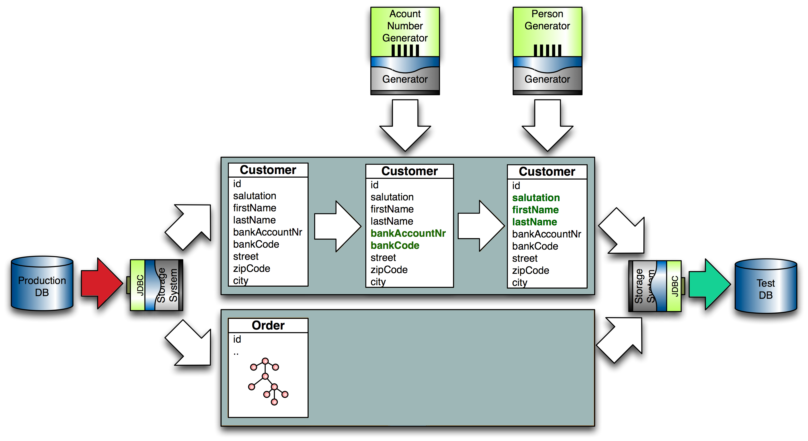

# Data Anonymization Concepts

## The Basic Idea

The approach for anonymizing production data is to ```<iterate>``` over existing data and
overwrite data fields with privacy concerns making use of all the features you learned above  
in [Data Generation Concepts]. 

If you need to assure multi-field-dependencies when overwriting, 
you can choose a prototype-base approach: import data from one source and merge it with
prototypes that are generated or imported from another source.

When importing data for functional and performance testing, you may need to add a 
[Data Postprocessing Stage]. 

In the following example, customers are imported from a database table in a production database (prod_db), anonymized and exported to a test
database (test_db). All attributes that are not overwritten, will be exported as is. Since customer names and birth dates need to be anonymized, a
prototype generator (...PersonGenerator) is used to generate prototypes (named person) whose attributes are used to overwrite production customer
attributes:

```xml
<iterate source="prod_db" type="db_customer" consumer="test_db">
  <variable name="person" generator="com.rapiddweller.domain.person.PersonGenerator"/>
  <attribute name="salutation" script="person.salutation" />
  <attribute name="first_name" script="person.givenName" />
  <attribute name="last_name" script="person.familyName" />
  <attribute name="birth_date" nullable="false" />
</iterate>
```




## Anonymization Report (Enterprise Edition)

For compliance checking, Enterprise Edition provides an anonymization Tracker.
It is activated on the command line by calling 

```benerator --anonreport```

and creates a report listing each field name and which percentage of its occurrences 
were changed in anonymization. The report is exported to a tab-separated CSV file named 
```anonymization-report.csv``` and to the console:

```
+-------------------------------------------------------------+
| Anonymization Report:                                       |
| Date/Time  2021-09-16 21:59:58 MESZ                         |
| Anonymized 500000 entities                                  |
| Checked    500000 entities (100%)                           |
+-------------------------------------+-----------+-----------+
| Field                               | # Checked | % Changed |
+-------------------------------------+-----------+-----------+
| order.street                        |   500,000 |    100.0% |
+-------------------------------------+-----------+-----------+
| order.city                          |   500,000 |     99.3% |
+-------------------------------------+-----------+-----------+
| order.cardno                        |   500,000 |       all |
+-------------------------------------+-----------+-----------+
| order.date                          |   500,000 |      none |
+-------------------------------------+-----------+-----------+
| order.express                       |   500,000 |      none |
+-------------------------------------+-----------+-----------+
| order.gift                          |   500,000 |      none |
+-------------------------------------+-----------+-----------+
```

When anonymizing large amounts of complex data structures, you will notice that this 
tracking has a substantial performance impact, which may slow down performance 
by a factor of 10 or more. There are two combinable approaches to address this:

1. reducing the check to the fields which are relevant for privacy
2. Partial anonymization checking


### Reducing the check to relevant fields

Anonymization is not done for fun but for privacy protection, so it is legitimate to 
reduce the anonymization check to the fields which are relevant for this purpose. 
In most applications, sensitive data is only a small part of all data and 
anonymization checking overhead is strongly reduced.

This restriction is defined by listing the fields to be checked in an 
```<anon-check>``` element:

```xml
<anon-check>street, city, cardno</anon-check>
```

You will then notice faster execution and a shorter report 
(restricted to the fields above):

```
+-------------------------------------------------------------+
| Anonymization Report:                                       |
| Date/Time  2021-09-16 21:59:58 MESZ                         |
| Anonymized 500,000 entities                                 |
| Checked    500,000 entities (100%)                          |
+-------------------------------------+-----------+-----------+
| Field                               | # Checked | % Changed |
+-------------------------------------+-----------+-----------+
| order.street                        |   500,000 |    100.0% |
+-------------------------------------+-----------+-----------+
| order.city                          |   500,000 |     99.3% |
+-------------------------------------+-----------+-----------+
| order.cardno                        |   500,000 |       all |
+-------------------------------------+-----------+-----------+
```


### Anonymization Sample Checking

If the reduction of fields to check is not fast enough (or undesired), 
you can additionally (or alternatively) reduce the checks to random samples of the 
anonymized data. In order to do so, you specify the percentage of data samples 
to be checked as command line argument on the Benerator call, for example a 
sample size of 10% of all data would be checked when specifying

```benerator --anonreport 10```

Then your report may look like this (when combined with field reduction):

```
+-------------------------------------------------------------+
| Anonymization Report:                                       |
| Date/Time  2021-09-16 21:59:58 MESZ                         |
| Anonymized 500,000 entities                                 |
| Checked    50,075 entities (10%)                            |
+-------------------------------------+-----------+-----------+
| Field                               | # Checked | % Changed |
+-------------------------------------+-----------+-----------+
| order.street                        |    50,075 |    100.0% |
+-------------------------------------+-----------+-----------+
| order.city                          |    50,075 |     99.3% |
+-------------------------------------+-----------+-----------+
| order.cardno                        |    50,075 |       all |
+-------------------------------------+-----------+-----------+
```

### Comparing Anonymization Tracking Performance

Which approach performs better is heavily dependent on the properties of your individual data structures.

A rule of thumb: For projects for large data structures, the fields restriction approach performs better,
for projects with smaller data structures the sampling approach.

A non-represantative example project with large data objects of which only a small number of fields 
needed to be anonymized, exhibited the following performance:

| Method                             | Performance |
| ---                                |        ---: |
| No anonymization tracking          |    120 ME/h |
| Full anonymization tracking        |     10 ME/h |
| 10% samples tracking               |     56 ME/h |
| Restricted fields tracking         |     65 ME/h |
| Restricted fields and 10% samples  |     75 ME/h |

ME/h stands for million entities per hour.


## 'condition'

When anoymizing or importing data, you may need to match multi-field-constraints of the form 
"if field A is set then field B must be set and field C must be null“. It many cases, 
an easy solution is to import data, mutate only non-null fields and leave null-valued fields 
as they are. 

A shorter syntax element to do so is the ```condition``` attribute. 
It contains a condition and when added to a component generator, the generator is only
applied if the condition resolves to true:

```xml
<iterate source="db1" type="customer" consumer="">
    <attribute name="vat_no" condition="this.vat_no != null" pattern="DE[1-9][0-9]{8}" unique="true" />
</iterate>
```

## Data Converters

Converters are useful for supporting using custom data types (e.g. a three-part phone number) and common conversions (
e.g. formatting a date as string). Converters can be applied to entities as well as attributes by specifying a converter attribute:

```xml
<generate type="TRANSACTION" consumer="db">
  <id name="ID" type="long" strategy="increment" param="1000" />
  <attribute name="PRODUCT" source="{TRANSACTION.PRODUCT}" converter="CaseConverter"/>
</generate>
```

For specifying Converters, you can

- use the class name
- refer a JavaBean in the Benerator context
- provide a comma-separated Converter list in the two types above

Benerator supports two types of converters:

1. Classes that implement Benerator's service provider interface (SPI) com.rapiddweller.common.Converter
2. Classes that extend the class java.text.Format

If the class has a 'pattern' property, Benerator maps a descriptor's pattern attribute to the bean instance property.
