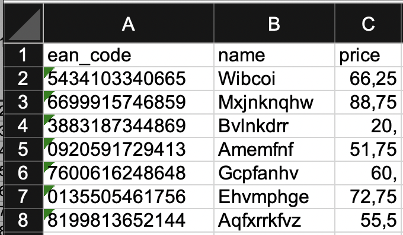

# Data File Processing

## CSV Import and Export

### Iterating entity data from a CSV file

You can iterate entity data from a CSV file by assigning the file with the extension '.ent.csv' and specifying the file
name as 'source' in an `<iterate>` statement, e.g. for printing the data to the console:

```xml

<iterate type="user" source="user.ent.csv" consumer="ConsoleExporter"/>
```

This way, you need to have a CSV file which uses column headers and the default column separator (which is comma by
default and can be set globally in the root element's defaultSeparator attribute, e.g. to a
semicolon: `<setup defaultSeparator=";">`)

If the CSV file does not have headers or uses another separator or file encoding that deviates from the default, you
need to configure the CSV import component (CSVEntitySource) explicitly with a `<bean>` statement and refer it later:

```xml

<setup>

    <bean id="in" class="CSVEntitySource">
        <property name="uri" value="headless-in.csv"/>
        <property name="separator" value=";"/>
        <property name="encoding" value="UTF-8"/>
        <property name="columns" value="name,age"/>
    </bean>

    <iterate type="user" source="in" consumer="ConsoleExporter"/>
</setup>
```

For CSV files without a header, you need to specify a comma-separated list of column names in the 'columns' property.

### Creating CSV files

For creating a CSV file you must always take the same approach as above: Defining a bean with its properties and
referring it as consumer:

```xml

<setup>

    <bean id="out" class="CSVEntityExporter">
        <property name="uri" value="target/headless-out.csv"/>
        <property name="columns" value="name, age, check"/>
    </bean>

    <generate type="product" count="200" consumer="out"/>
</setup>
```

See the [Component Reference](component_reference.md#csventityexporter) for more details.


## Excel&#8482; File Processing

When choosing to include Excel files in your data generation/anonymization, always be aware, 
that its data capacity is limited to 65,535 rows.

### Iterating Entity Data from an Excel&#8482; File

```xml
<iterate type="product" source="products.xls" consumer="ConsoleExporter"/>
```


### Creating Excel&#8482; Files

```xml
<generate type="product" count="7" consumer="new XLSEntityExporter('products.xls')">
    <attribute name="ean_code" pattern="[0-9]{13}"/>
    <attribute name="name" pattern="[A-Z][a-z]{5,12}"/>
    <attribute name="price" type="double" min="0.25" max="100.00" granularity="0.25"/>
</generate>
```

creates an Excel file like this:




## Fixed Column Width File Processing

A Fixed Column Width (FCW) files contain data in a text table format easily readable for humans.
A product list my look like this:

```
0539401811799 Evian Water         1.25
1347354927249 Lindt Chocolate     2.75
2335882183280 Sanbitter           6.75
9071782830384 Beluga Caviar     100.00
9965715556715 Black Truffles     85.75
```    

Note that, since a column header may require the column to be too wide, it is often left out.
Beyond its width, each column may have additional formatting requirements:
- Alignment: Left, right, centered
- Fixed number of fraction Digits
- Padding character (for example '0' for numbers)

Another way to format the above data may be

```
0539401811799 Evian Water______ 001.25
1347354927249 Lindt Chocolate__ 002.75
2335882183280 Sanbitter________ 006.75
9071782830384 Beluga Caviar____ 100.00
9965715556715 Black Truffles___ 085.75
```    

Benerator supports column format definition in a short syntax:
```
<width>[.<fraction digits>]<alignment>[<pad character>]
```

| Field           | Description                                   | Default          |
| ---             | ---                                           | ---              |
| width           | The total number of characters for the column |                  |
| fraction digits | The number of fraction digits to display      | &lt;not used&gt; |
| alignment       | l for left, c for centered, r for right       | l                |
| pad character   | a character used to reach the column width, usually a space character or sometimes 0 for numbers | &lt;space&gt; |

Examples:

- `name[16l]` : Print the name left-aligned with 16 characters (padding spaces at the right)

- `price[8.2r0]` : Print the price right-aligned with a total of 8 characters (5 integer digits + the decimal point + 2 fraction digits), 
padded at the left using zeros. Example: `00033.25`

The complete columns' configuration is expressed as a comma-separated list of column specifications.

The FCW support classes FixedWidthEntitySource and FixedWidthEntityExporter are in the 
platform package 'fixedwidth' and make use of a similar configuration API:

```xml
    <import platforms="fixedwidth"/>

    <bean id="products_file" class="FixedWidthEntityExporter">
        <property name="uri" value="shop/products.import.fcw"/>
        <property name="properties" value="ean_code[13],name[30],price[8r0]"/>
    </bean>
```

### Iterating Entity Data of a Fixed Column Width File

For iterating data of Fixed Column Width files, you need to provide one more 
configuration detail than the example above: the 'entity' property tells 
Benerator as which entity type to interpret the file content.

```xml
<setup>
    <import platforms="fixedwidth"/>
    
    <bean id="products_file" class="FixedWidthEntitySource">
        <property name="uri" value="shop/products.import.fcw"/>
        <property name="entity" value="product"/>
        <property name="properties" value="ean_code[13],name[30],price[8r0]"/>
    </bean>

    <iterate type="product" source="products_file" consumer="ConsoleExporter"/>
</setup>
```


### Creating Fixed Column Width File
```xml
<setup>
    <import platforms="fixedwidth"/>

    <bean id="products_file" class="FixedWidthEntityExporter">
        <property name="uri" value="export.fcw"/>
        <property name="columns" value="ean_code[14],name[16l],price[8.2r]"/>
    </bean>

    <generate type="product" count="7" consumer="products_file,ConsoleExporter">
        <attribute name="ean_code" pattern="[0-9]{13}"/>
        <attribute name="name" pattern="[A-Z][a-z]{5,12}"/>
        <attribute name="price" type="double" min="0.25" max="100.00" granularity="0.25"/>
    </generate>
</setup>
```

creates a file like this:

```
0539401811799 Sekyybauld         90.75
1347354927249 Flntqqwkq          55.00
2335882183280 Wdlbjkv             9.75
9071782830384 Snhhlqoqgabo       89.00
9965715556715 Exqygflwbzgkn      31.75
5500154197720 Ctiskrmjjps         5.00
4379247967662 Xmuudbkpyz         39.00
```    


## JSON File Generation and Anonymization (Enterprise Edition)

### Iterating entity data from a JSON file

You can iterate entity data from a JSON file by assigning the file with the extension
'.json' and specifying the file name as 'source' in an `<iterate>` statement,
e.g. for printing the data to the console:

```xml
<iterate type="user" source="users.json" consumer="ConsoleExporter"/>
```

An example source file 'users.json' may look like this:

```json
[
    {
        "name":"Alice",
        "age":23
    },
    {
        "name":"Bob",
        "age":34
    },
    {
        "name":"Charly",
        "age":45
    }
]
```


### Creating JSON files

Generated data is exported to a JSON file by defining a consumer like this: 
`consumer="new JsonFileExporter('gen-persons.json')"`

```xml
<?xml version="1.0" encoding="UTF-8"?>
<setup>
    <generate type="person" count="5" consumer="new JsonFileExporter('gen-persons.json')">
        <attribute name="name" pattern="Alice|Bob|Charly"/>
        <attribute name="age" type="int" min="18" max="67"/>
    </generate>
</setup>
```
