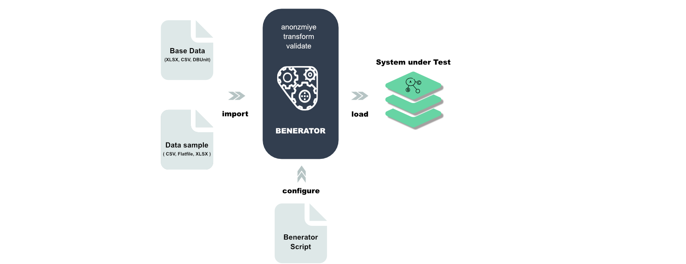
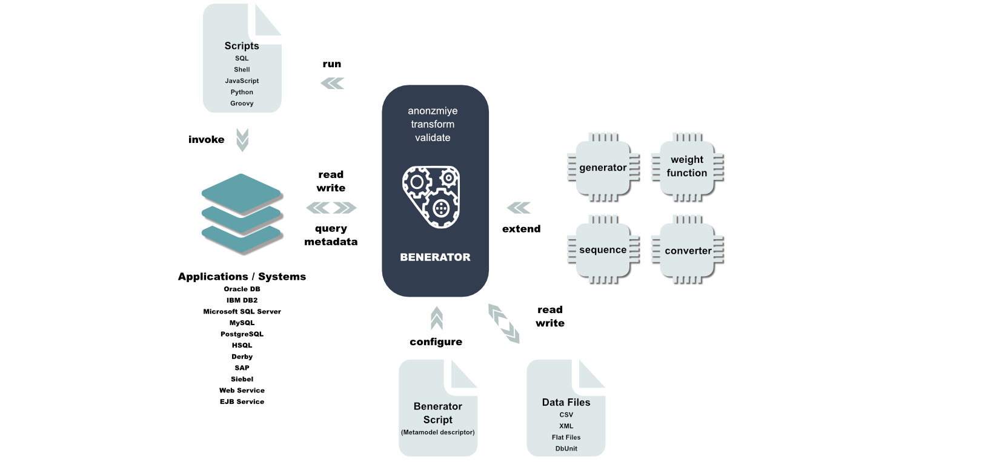

# Introduction to Benerator

## Goals

The core goals of Benerator are

- Generation of data that satisfies complex data validity requirements
- Anonymization of production data for showcases and serious performance testing projects
- Efficient generation of large data volumes, scaling up to companies with billions of customers and Big Data projects
- Early applicability in projects
- Little maintenance effort with ongoing implementation through configuration by exception
- Wide and easy customizability
- Applicability by non-developers
- Intuitive data definition format
- Satisfying stochastic requirements on data
- Extraction and anonymization of production data
- Supporting distributed and heterogeneous applications
- Establishing a common data generation platform for different business domains and software systems

## Features

### Data Synthesization

Performance test data can be completely synthesized. A basic setup can be imported e.g. from DbUnit files, CSV files and fixed column width files. A
descriptor file configures how imported data should be processed and adds completely synthesized data. The processed or generated data finally is
stored in the system under test.

### Production Data Anonymization

Production data can be easily extracted from production systems. Tables can be imported unmodified, filtered, anonymized and converted.

## State of the Benerator

Benerator is developed and continuously extended and improved since June 2006\. Benerator is mainly used and tested best for the data file and database
data generation, for these applications Benerator should help you with almost all your data generation needs out of the box - and extending Benerator
for specific needs is easy.

XML-Schema, on the other hand, allows for an extraordinarily wide range of features. Benerator's XML support is limited to features that are useful
for generating XML data structures (no mixed content) and does not yet support all variants possible with XML schema. The elements `<unique>`, `<key>`
and `<keyRef>` cannot be handled automatically, but require manual configuration. The following features are not yet implemented: `<group>`
, `<import>`, `<all>` and `<sequence>` with `minCount != 1` or `maxCount != 1`\. If you need support for some of these, please contact us.

## Building Blocks

## Database Support

All common SQL data types are supported.

Benerator was tested with and provides examples for

- Oracle 19c (thin driver)
- DB2
- MS SQL Server
- MySQL 5
- PostgreSQL 12
- HSQL 2.x
- H2 1.2
- Derby 10.3
- Firebird

## Benerator Editions

Benerator comes in different editions which differ by feature set, scalability and performance:

### Performance Comparison
The results below show Benerator's generation and anonymization performance on a plain 
MacBook Air (2020) with standard equipment and Azul Java Virtual Machine 
(CE = Community Edition, EE = Enterprise Edition):

| Benchmark | CE 1.1.2 | CE 2.0.0 | EE 2.0.0 / 1 Thread | EE 2.0.0 / 4 Threads | 
| --- | ---: | ---: | ---: | ---: |
| gen-string.ben.xml           |    37 |    58 |   336 | 1,095 |
| gen-person-showcase.ben.xml  |    26 |   119 |   111 |   327 |
| anon-person-showcase.ben.xml |    31 |   120 |   113 |   328 |
| anon-person-regex.ben.xml    |   346 |   537 |   838 | 1,381 |
| anon-person-hash.ben.xml     |   386 |   500 | 1,299 | 1,287 |
| anon-person-random.ben.xml   |   576 |   838 | 1,514 | 1,736 |
| anon-person-constant.ben.xml | 2,210 | 2,745 | 2,646 | 2,162 |

The numbers are million entities generated/anonymized per hour.
Compared to CE 1.1.2's generation engine,
CE 2.0.0 is 1.5-2 times faster 
and EE 2.0.0 with 4 threads is roughly 4 times faster 
and scales further with the number of CPUs on your machine.

### Benerator Community Edition (CE)

Benerator started as an open-source project and is committed to further improve and extend
with and from the feedback of its user base and its contributors.
It is the most powerful open-source data generator and is competitive with all commercial
products.

However, it has two historic limitations:
- No neat graphical user interface
- Only single-threaded generation and anonymization

Though, Benerator Community Edition still has an impressive performance. 

### Benerator Enterprise Edition (EE)

Extends Benerator Community Edition and improves it in many respects. 
With highly-optimized engine and generation-related components 
and with multithreaded execution support, its performance on a single
machine is about 10x the performance of the Community Edition 
and Benerator can easily scale over multiple machines in your private cloud / cluster setup.

Improvements against the Community Edition are

- Improved performance on single threading
- Multithreaded data generation and anonymization
- Anonymization Reporting supports you in compliance checking
- Benerator UI: An integrated graphical development environment with editing support, project and task management
- JSON support
- JMS support: ActiveMQ, RabbitMQ and more
- Kafka support
- Industry modules: Logistics, Insurance, Finance, ...
